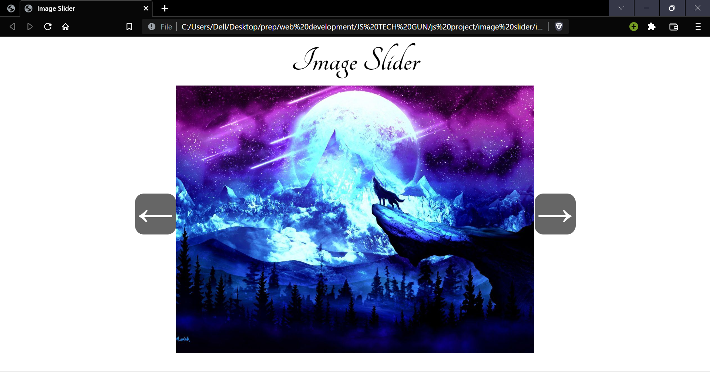

# Image Slider
HTML-5, CSS-3, Vanilla JS ES-6

### Links
image-slider-rosy.vercel.app

## Table of contents

- [Overview](#overview)
- [Screenshot](#screenshot)
- [Links](#links)
- [Built with](#built-with)
- [Useful resources](#useful-resources)
- [Author](#author)

## Overview
Welcome to our captivating Image Slider website, expertly crafted with HTML5, CSS3, and Vanilla JavaScript. Its user-friendly interface allows you to navigate through a collection of images effortlessly, experiencing a smooth and captivating slide show.

### Screenshot
- Preview, click on left/right arrows to navigate across images

### Built with
- Semantic HTML5 markup
- CSS custom properties
- Flex-box
- Vanilla JS

### Useful resources
- W3schools (https://www.w3schools.com/)
- MDN web Docs (https://developer.mozilla.org/en-US/)

## Author
Priya
- GitHub: (https://github.com/Priya-git21)
- LinkedIn: (https://www.linkedin.com/in/priya-makkar-851973223/)
